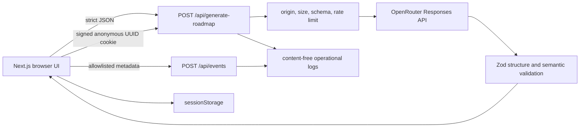

# DevPath AI

DevPath AI converts a target job description and a candidate's current evidence into a validated job-readiness roadmap. It returns requirement coverage, prioritized gaps, four to six learning phases, exactly two portfolio projects, an application timeline, and optional certification guidance.

[MIT License](LICENSE)

## Prerequisites

- Node.js 22 LTS
- npm 10 or newer
- An OpenRouter API key with access to the configured model
- Chromium and WebKit for the browser test suite

## Local Setup

```bash
npm install
npx playwright install chromium webkit
cp .env.example .env.local
npm run dev
```

Open `http://localhost:3000`. The browser URL must exactly match `APP_ORIGIN`.
With the documented defaults, only `OPENROUTER_API_KEY` needs a value:

| Variable | Required | Purpose |
| --- | --- | --- |
| `OPENROUTER_API_KEY` | Yes | Server-only OpenRouter credential |
| `OPENROUTER_MODEL` | No | Structured-output model; defaults to `xiaomi/mimo-v2.5-pro` |
| `OPENROUTER_BASE_URL` | No | OpenRouter API root; defaults to `https://openrouter.ai/api/v1` |
| `OPENROUTER_SITE_URL` | No | Site URL sent in OpenRouter attribution headers |
| `OPENROUTER_APP_NAME` | No | Application name sent in OpenRouter attribution headers |
| `GENERATION_TIMEOUT_MS` | No | Provider request deadline in milliseconds; defaults to `120000` |
| `APP_ORIGIN` | Yes | Exact browser origin accepted by POST routes; use `http://localhost:3000` locally |
| `COOKIE_SECRET` | Production | Strong unique secret for signing anonymous browser UUID cookies |

Never expose `OPENROUTER_API_KEY` through a `NEXT_PUBLIC_` variable.

## Commands

```bash
npm run dev
npm run lint
npm run typecheck
npm test
npm run build
npm run test:e2e
npm start
```

## Architecture



The App Router server owns provider calls and credentials. Zod contracts are the single source of truth for request, model-output, response, error, and event shapes. The browser state machine rejects stale completions and persists only a validated request/result pair.

## Privacy And Security

- `sessionStorage` is browser-local, scoped to the current tab session, and is not a server database.
- Server logs and analytics must never include job descriptions, profiles, skills, constraints, prompts, generated roadmaps, provider messages, or stack traces.
- Prompt layers treat job and profile text as untrusted data.
- Browser CSP permits `connect-src 'self'`; OpenRouter is reachable only from server code.
- POST routes enforce exact origin, byte limits, strict schemas, and no-store responses.
- The in-process limiter permits five generations per ten minutes per HMAC-signed anonymous UUID cookie. It does not use IP addresses, so users behind one gateway do not share a bucket.
- Clearing or blocking cookies creates a new browser identity. Treat this as a fair-use and cost-control guard; production still needs separate edge abuse protection.

Allowed log metadata is limited to: event name, timestamp, request ID, stable error code, export format, section ID, duration milliseconds, model identifier, schema version, input/output/reasoning token counts, and retry count.

## Deployment

The landing demo is hosted by YouTube and loaded through
`youtube-nocookie.com` only after the visitor selects Play. The repository
contains only a compressed poster image; do not commit the video binary.
Keep `frame-src https://www.youtube-nocookie.com` in the production Content
Security Policy.

1. Run the complete release gate locally.
2. Deploy the standalone Next.js output to a Node.js 22 platform.
3. Configure a restricted OpenRouter key, `OPENROUTER_MODEL=xiaomi/mimo-v2.5-pro`, `OPENROUTER_BASE_URL=https://openrouter.ai/api/v1`, `GENERATION_TIMEOUT_MS=120000`, the exact production `APP_ORIGIN`, and a strong unique `COOKIE_SECRET`.
4. Configure production edge abuse protection without treating a shared gateway IP as the sole user identity.
5. Verify CSP and no-store headers at the public origin.
6. Run the staging smoke test before promoting traffic.

## Staging Smoke Test

1. Submit synthetic profile data and a job description containing a prompt-injection sentence.
2. Confirm the instruction is ignored and the response contains four to six phases and exactly two projects.
3. Confirm the earliest application point is visible.
4. Refresh and verify browser-session restoration.
5. Download Markdown and open the print dialog.
6. Clear local data and verify the empty form receives focus.
7. Search logs for submitted marker text and confirm it is absent.

## Rollback

Keep the previous immutable application image and environment configuration. If generation, validation, privacy, or CSP checks regress, remove traffic from the new release, restore the previous image, and confirm the homepage, API availability, and one synthetic generation. Rotate the provider key immediately if credentials or user content may have been exposed. Preserve only content-free operational records for incident analysis.
