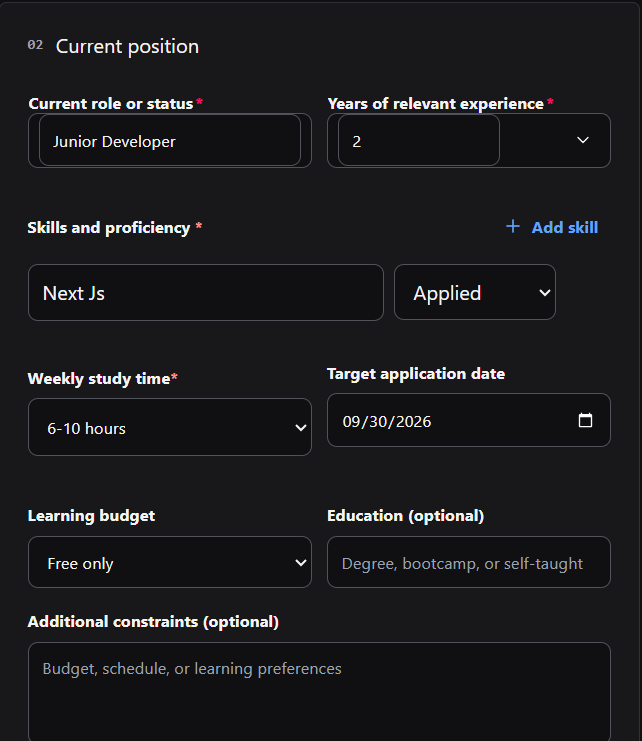
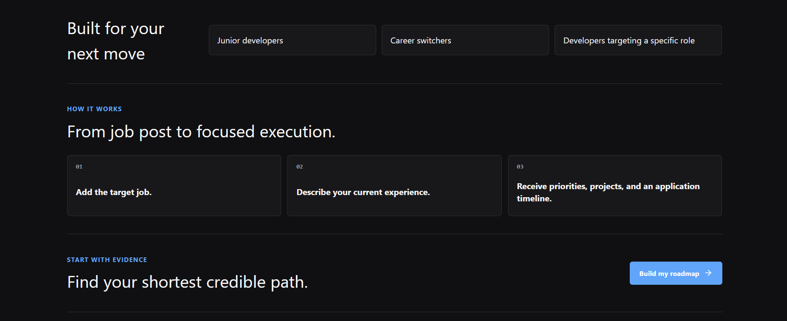
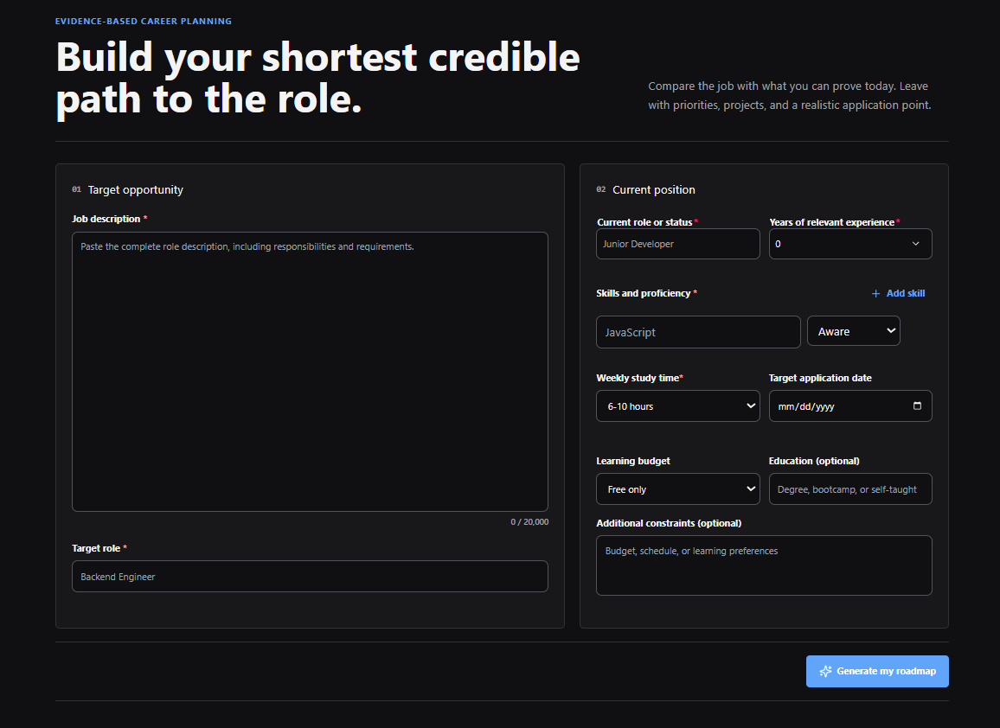
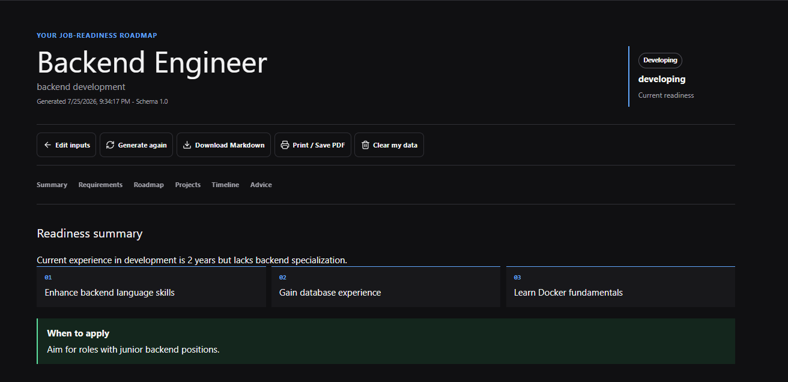
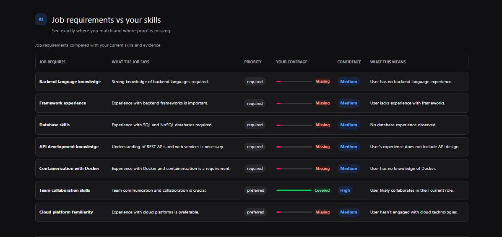
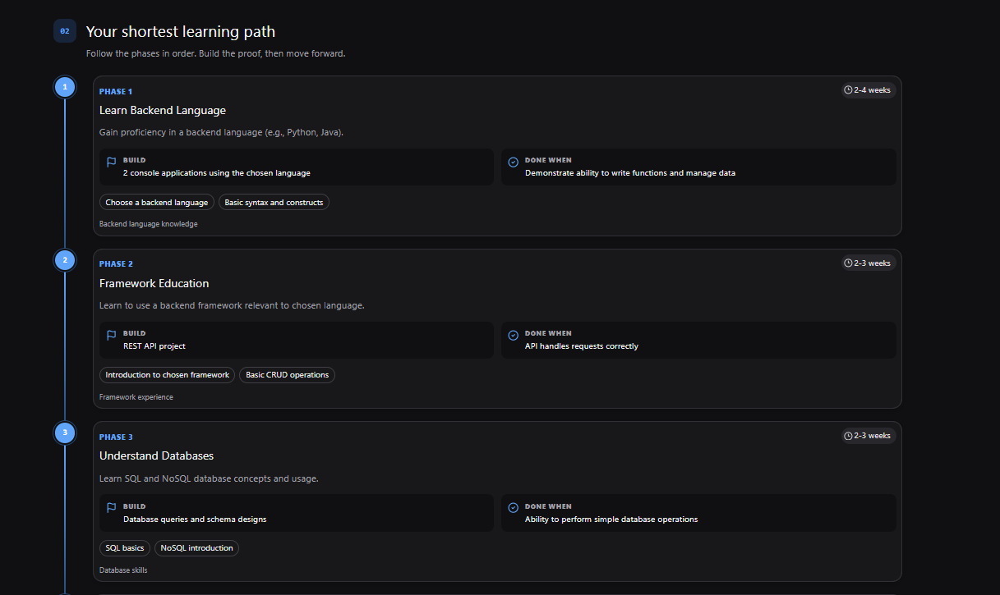
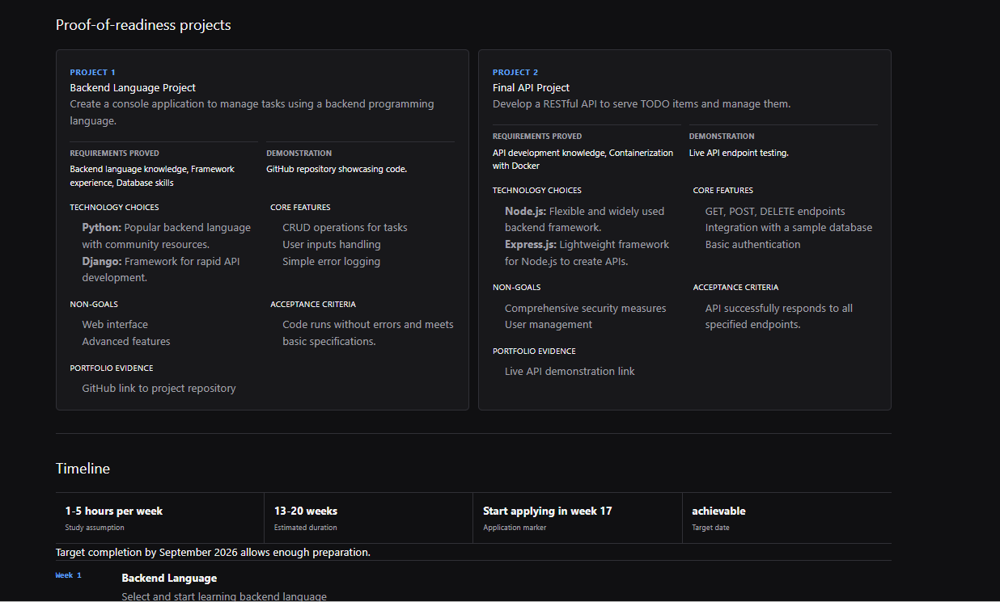
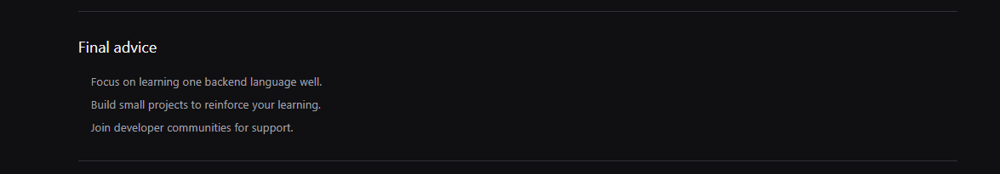

<!-- ch-4 personal-project report -->

# CH-4 Personal Project Report

## Project

- **GitHub Username:** @HtetLinLinNaing
- **Repository:** https://github.com/HtetLinLinNaing/DevPath-AI
- **Live Demo:** https://devpath-ai-three.vercel.app
- **License:** MIT
- **One-line Summary:** DevPath AI transforms a target job description and a candidate's current experience into a validated, personalized career roadmap with prioritized skill gaps, structured learning phases, portfolio project recommendations, and an application timeline.

## Product Introduction Slides

- **Slides:** `slides/pitch.md`

## Demo Screenshots

### Desktop Walkthrough

### Mobile Responsive Walkthrough

## Notes

DevPath AI helps junior developers, career switchers, and self-taught engineers create a clear path toward their target software engineering roles. The application:

- Generates validated, structured career roadmaps from a target job description.
- Identifies and prioritizes skill gaps based on the user's current experience.
- Recommends learning phases, portfolio projects, and an application timeline.
- Keeps AI provider credentials securely on the server.
- Uses privacy-conscious request handling.
- Includes an embedded YouTube demo that users can launch from the landing page.
